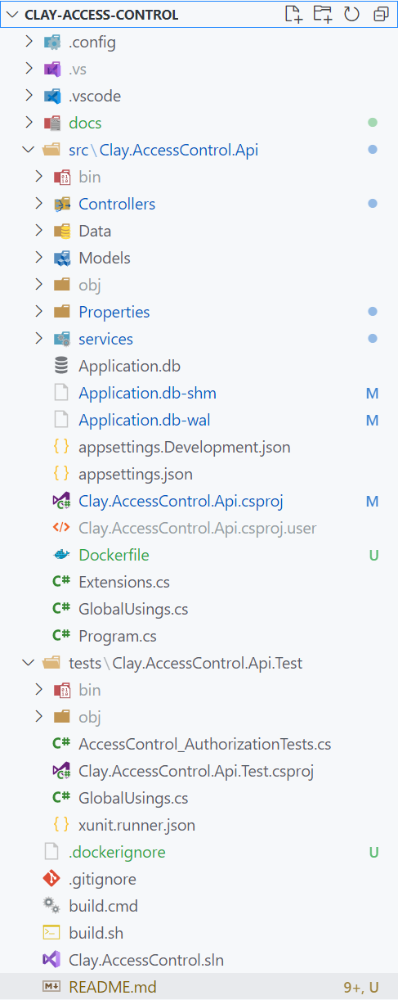

---
## [Live Demo (Swagger, API) ](https://clay.mesbahi.net/swagger/index.html)
## [Video Presentation](https://youtube.com)
---
## About Implementation
> Since there was little data provided about the details and deciding about a large part of the analysis and design of the implementation was my responsibility. So, I started designing and implementing the backend of services to authorize tags to [open|not open] locks and APIs to get audit histories (All records, for a specific user, and for a specific lock).
> * It's a fully running application
> * Important functionalities was covered by unit tests
> * **Based on project size and requirements, I tried to avoid unnecessary complexities in code to get maximum readability, speed, testability and maintainability of the project.**

---


## **Backend API**
---
### Technology stack and used libraries
* **For development:** .NET 6, C# 10, Entity Framework Core, SQLite, Swagger
* **For unit tests:** XUnit + Xunit.DependencyInjection + Moq + Moq.EntityFrameworkCore

## **Data model**
---


1. First, we have to define lock(s)
1. Then, we will save user(s)
1. Tags will be defined to opening the doors, each tag owned by a user, and can open one or more locks, we can deactivate tags

## **Business overview**
---
It's a simple app; it has one REST method to check the access ```/v1/Access/AccessRequest``` within posting lock id and tag id; if the tag is correct and enabled and authorized for this lock, it will return "true" and the door will open.

Based on the nature of this business, security is critical, so I store all details regardless of whether it is successful or not independently as an audit log record. Audit history can be accessed as a whole, for a specific user, or a specific lock with pagination; why? Because this entity is probably has a vast number of records.

## **Technical overview**
---
* According to the assignment files and the nature of Clay's business, it's essential to make this application DevOps friendly and scalable; so, I added ```build.cmd``` and ```build.sh``` in order to use in the CI/CD pipelines and ```dockerfile``` to make the docker image. Yes, in the production environment, it's good to use docker containers with docker swarm or K8S and a high-available load-balancer to distribute requests on different containers/pods to achieve high availability load-balancing and side-by-side versioning without downtimes.

* The clients can be both mobile and web, so the best protocol in this situation is REST, but maybe in the future and according to the requirements, we can think about GraphQL or gRPC.

* Testing and specially usint test is an important part of developing these types of applications (honestly speaking, for all kind of applications ;)<br>I used DI for injecting services into the unit test project and a seed file for providing static data for the testing database to use a fresh database before each test run. I tried to develop unit tests to cover all situations of inputs ([wrong | disabled | unauthorized | valid] tags, etc.)

* Also, clean code, clean architecture, and avoiding unnecessary developments are considered while doing this assignment.

* I do not suggest SQLite in the production environment because MySQL, MSSQL, Cosmos DB, etc., can be good alternatives to provide more scalability and availability. Using DBMSs like Cosmos DB, we can achieve Geo-Replication. In this software, replacing the DBMS is straightforward because the persistence layer is developed with DI, so it needs only a few changes.

* Because it is a test case, the lag of monitoring facilities, telemetry, logging, etc., could be acceptable and considered TODOs for the post-MVP future.

---
### **Running the application**
```
# make migrations
dotnet ef migrations add "InitDatatbase" -o "Data/Migrations" -c "AccessControlDbContext" -p ./src/Clay.AccessControl.Api/Clay.AccessControl.Api.Api.csproj

# update the database + seeding
dotnet ef database update  -c "AccessControlDbContext" -p ./src/Clay.AccessControl.Api/Clay.AccessControl.Api.Api.csproj

# run the application
dotnet run --project .\src\Clay.AccessControl.Api\Clay.AccessControl.Api.csproj

# build + running tests (Windows)
./build.cmd

# build + running tests (Linux)
./build.sh

# docker file also provided
```

## **Swagger**

<br>


## **Project structure**



## **Unit Tests Results**


## **Build and Unit Tests Result [No Errors, No Warnings, All Passed :)]**


---
<br>

# Clay test case back-end

## Introduction

First of all: Thanks a lot for committing to this assignment! We understand that it puts a claim on your spare time. The reason we ask potential new team members to work on this test is actually quite simple. Clay’s goal is to connect 1.000.000 locks to our Cloud platform with only 50 people. So you bet we need the best. All current team members have passed this test so we believe that everyone therefore may expect equal (or better) level.

### What our development team believes in

We sat down to define what is needed to achieve that “1.000.000/50” goal and from a development perspective this is what we believe in:

> ***WE STRIVE TO...***<br> 
Deliver quality and stable products. Host all 
products redundant, scalable and securely. 
Adhere to strict coding conventions. Get work done in an efficient and fast way and Keep it 
simple! 


## Business case

As Clay, we want an interface which allows users to open doors and show historical events to extend our user experience beyond classical tags. As you are applying for a backend position please take into account that your focus should be on the back-end, we expect a well-designed (and working) back-end.

## Background

In our office we have 2 doors through which people can access. The 1st door is the tunnel and the 2nd door is to enter the office. As Clay we want to extend our user experience by giving our users a front-end (either web or mobile) which allows people (with the correct security access) to open the doors. Currently the doors are only to be opened if you have a “tag” that is authorized.

## Take into account

The back-end should be ready to support both mobile/web consumers and built with scalability in mind. We strive to use continuous delivery, the codebase should be ready to support integration in such a tool.

## Deliverables

For time-management purposes take into consideration that you are applying for a backend position and that we want to assess your skills on this domain.

We work agile and according to SCRUM principles so we expect a fully running application.

In order to do a good review we would need:
1. The source code preferably in an online repository
1. A video (~ 5-10mins) with a working demo (you can create video using Postman and just hit
those endpoints without implementing any kind of UI)
1. 1-page document about the architecture and project decisions (why use technology A or B)
The deadline for submitting your test case is 7 days

## Summary

Only people that we believe will fit the team are asked to work on this assignment. So it’s not that we simply ask anyone to work
on it. That’s why we really hope you’ll give it your best because we so far in the process believe you
could be the great new team mate. Clay strives to improve quality and knowledge in the team.
Basically this means that we hope to learn from you, same as you can expect to learn from your future Clay team mates.